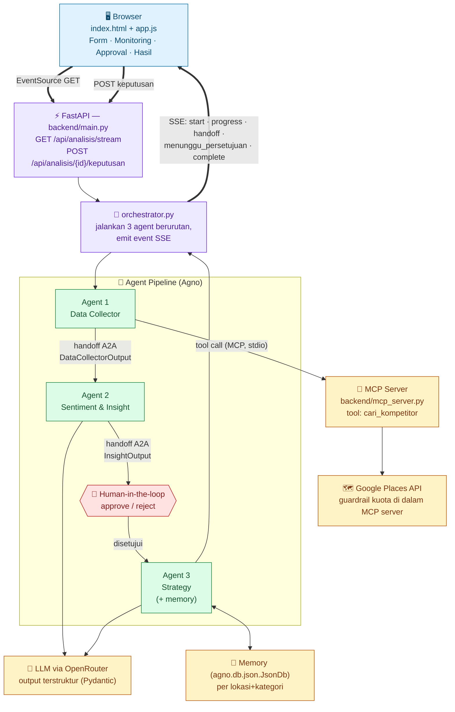
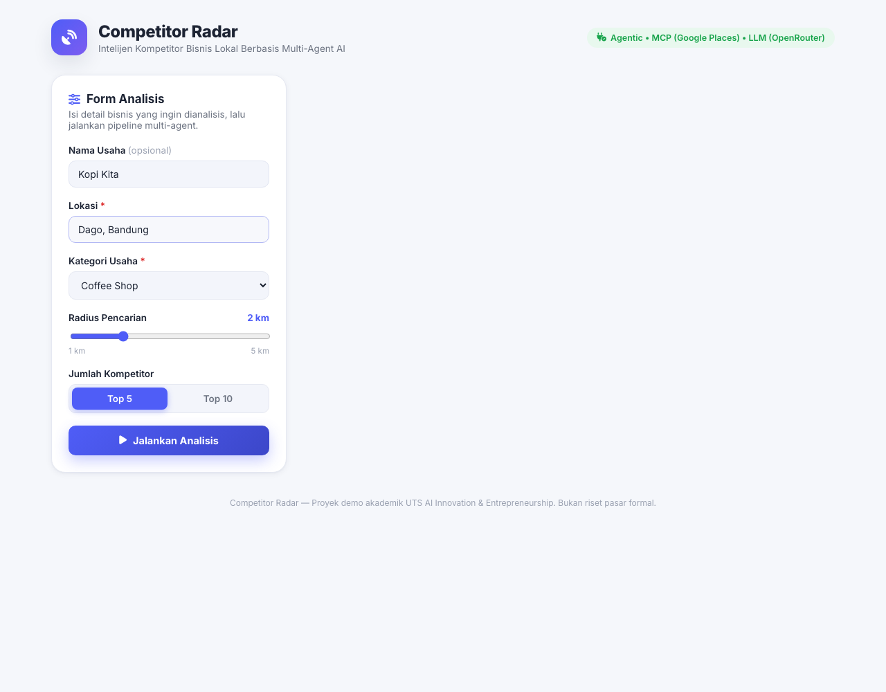
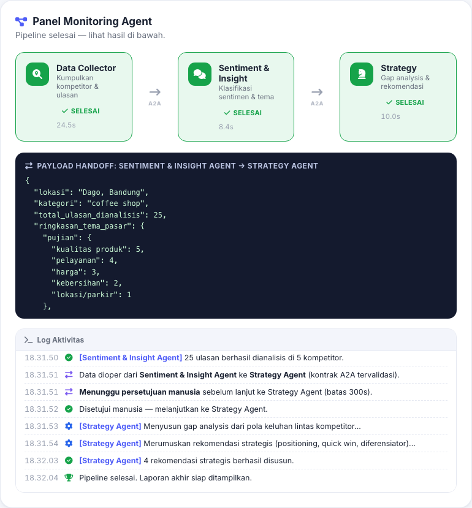
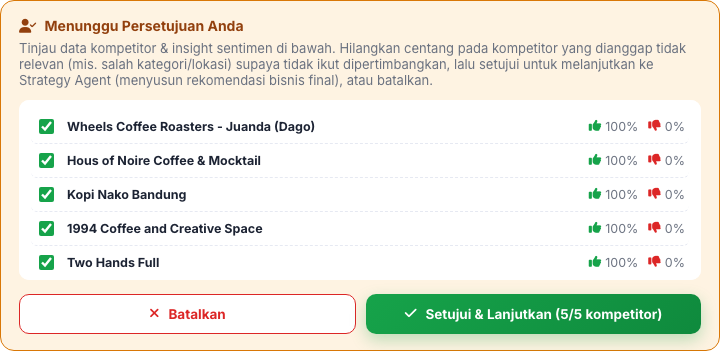
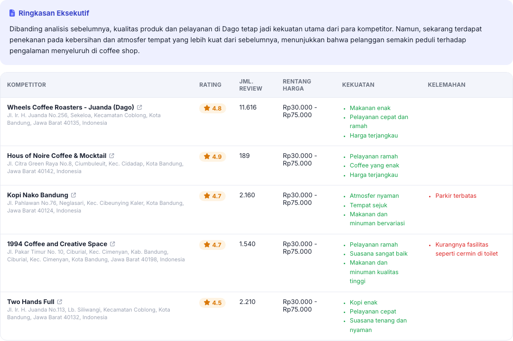
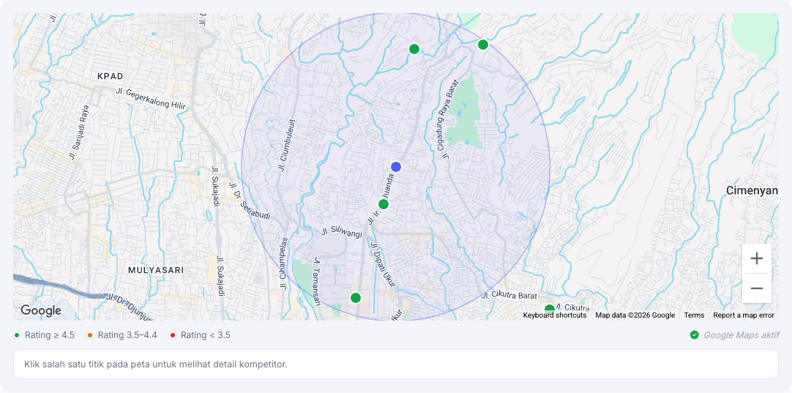
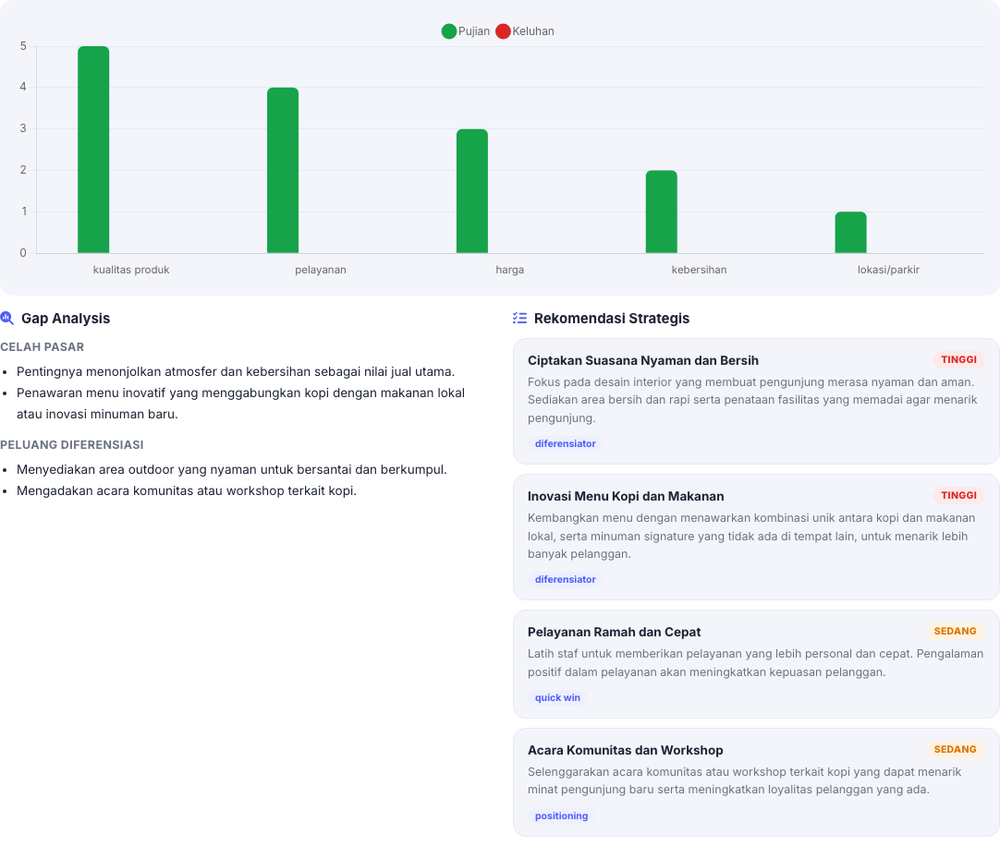

# Competitor Radar

Sistem intelijen kompetitor bisnis lokal berbasis **multi-agent AI**. Proyek demo akademik untuk UTS mata kuliah *AI Innovation & Entrepreneurship* — fokus pada kejelasan alur kerja agent (tool use lewat **MCP**, koordinasi **Agent-to-Agent**, titik **human-in-the-loop**, dan **guardrails** yang benar-benar ditegakkan sistem), bukan skala produksi.

Pengguna memasukkan lokasi & kategori usaha → tiga agent berjalan berurutan (Data Collector → Sentiment & Insight → **[titik persetujuan manusia]** → Strategy) → hasil berupa peta kompetitif, peta sebaran lokasi, analisis sentimen, gap analysis, dan rekomendasi strategis.

Kategori usaha bersifat **dinamis dan dapat dikonfigurasi** (bukan hardcode di logika agen) — cakupan saat ini meliputi Coffee Shop, Restoran, Salon, Bengkel, Klinik, Laundry, Apotek, Minimarket, Gym/Fitness, Toko Fashion, hingga Software Developer.

Data Collector Agent mengambil data kompetitor sungguhan lewat sebuah **MCP server** yang membungkus Google Maps Places API; Sentiment & Strategy Agent memakai LLM sungguhan lewat OpenRouter. `GOOGLE_MAPS_API_KEY` dan `OPENROUTER_API_KEY` **wajib** diisi sebelum aplikasi bisa start.

**Video presentasi & demo:** https://youtu.be/67yP7LDmujo

## Cara Menjalankan

Butuh Python **3.10+** dan dua API key (lihat [Konfigurasi Wajib](#konfigurasi-wajib-api-key)).

```bash
# 1) Buat virtual environment & install dependency (sekali saja)
python3 -m venv .venv
source .venv/bin/activate          # Windows: .venv\Scripts\activate
pip install -r requirements.txt

# 2) Salin .env.example -> .env lalu isi GOOGLE_MAPS_API_KEY & OPENROUTER_API_KEY
cp .env.example .env

# 3) Jalankan — SATU perintah ini menjalankan backend sekaligus men-serve frontend
uvicorn backend.main:app --reload
```

Kalau salah satu key kosong, server menolak start dan mencetak pesan error yang jelas (fail fast) — lihat `Settings.validasi_atau_gagal()` di `backend/config.py`.

Buka **http://127.0.0.1:8000** di browser. Selesai — form input, panel monitoring, panel persetujuan (human-in-the-loop), dan panel hasil semua ada di satu halaman itu.

**Ganti port** — tambahkan flag `--port`, mis. mau pakai port 8001:

```bash
uvicorn backend.main:app --reload --port 8001
```

Lalu buka `http://127.0.0.1:8001`. Dua hal yang wajib diperhatikan:
- Perintahnya **`backend.main:app`**, bukan `main:app` — modulnya ada di dalam folder `backend/` dan pakai *relative import*, jadi harus dijalankan sebagai package `backend.main`. Kalau ditulis `main:app` akan muncul error `Could not import module "main"`.
- Harus dijalankan dari folder **root proyek** ini (tempat folder `backend/` berada), bukan dari dalam `backend/` — Data Collector Agent men-spawn server MCP (`backend/mcp_server.py`) sebagai subprocess lewat `python -m backend.mcp_server`, yang butuh cwd di root proyek supaya resolusi package-nya benar.

## Arsitektur Singkat



- **Backend**: FastAPI + [Agno](https://github.com/agno-agi/agno) (framework agent). Setiap agent = satu file di `backend/agents/`. Kontrak data antar-agent didefinisikan terpusat di `backend/schemas.py` dengan Pydantic.
- **Realtime**: Server-Sent Events (SSE) satu arah backend → frontend. Tipe event: `start`, `progress`, `handoff` (preview payload JSON yang dioper antar-agent), `done` (per agent), `menunggu_persetujuan`/`disetujui`/`dibatalkan` (human-in-the-loop), `complete` (laporan akhir), `error`.
- **Frontend**: HTML + CSS + jQuery murni, tanpa build step. Disajikan langsung oleh FastAPI (`StaticFiles`) dari origin yang sama — tidak ada masalah CORS, meski `CORSMiddleware` tetap dipasang sebagai cadangan. Chart sentimen pakai Chart.js (CDN), ikon pakai Font Awesome (CDN).
- **MCP (Model Context Protocol)**: Data Collector Agent terhubung ke SATU tool, `cari_kompetitor`, yang diekspos oleh server MCP mandiri (`backend/mcp_server.py`, dibangun dengan `FastMCP`). Server ini di-spawn sebagai subprocess terpisah (stdio transport) oleh `agno.tools.mcp.MCPTools` setiap Data Collector Agent jalan. Agent-lah yang memutuskan kapan memanggil tool ini dan bagaimana bereaksi atas hasilnya (termasuk mencoba lagi dengan radius lebih besar kalau kosong) — bukan kode Python yang memanggil Google API secara langsung.
- **Human-in-the-loop**: pipeline berhenti setelah Agent 2 dan menunggu manusia menyetujui/menolak sebelum Agent 3 menyusun rekomendasi bisnis final. Lihat [bagian di bawah](#human-in-the-loop).
- **Memory**: Strategy Agent memakai `agno.db.json.JsonDb` (session per kombinasi lokasi+kategori) supaya analisis berulang untuk bisnis yang sama bisa membandingkan dengan hasil sebelumnya.
- **Peta sebaran kompetitor**: setiap kompetitor punya koordinat lat/lng asli dari Google Places.
  - Jika `GOOGLE_MAPS_API_KEY` diset (selalu, karena wajib) → frontend merender **Google Map sungguhan** dengan marker berwarna sesuai rating.
  - Nama kompetitor (di tabel peta kompetitif maupun popup peta) adalah **link ke Google Maps** (`place_id` asli), terbuka di tab baru.

Detail lebih lengkap (konvensi kode, struktur folder) ada di `CLAUDE.md`.

### Peran Masing-Masing Agent

Ketiga agent berjalan **berurutan**, bukan paralel — output satu agent (divalidasi Pydantic) langsung jadi input agent berikutnya (`backend/orchestrator.py`), meniru pola *Agent-to-Agent* (A2A). Ketiganya adalah `Agent` Agno sungguhan berbasis LLM (OpenRouter) — bukan heuristik.

**1. Data Collector Agent** (`backend/agents/data_collector.py`)
- **Tugas**: mencari daftar kompetitor di sekitar lokasi yang diminta (sesuai kategori & radius), lalu mengambil sampel ulasan tiap kompetitor.
- **Cara kerja**: Agno `Agent` dengan satu tool MCP (`cari_kompetitor`, lihat `backend/mcp_server.py`) yang membungkus Google Maps Places API — Geocoding (lokasi → koordinat) → Nearby Search (cari kompetitor) → Place Details (rating, harga, ulasan). Agent memutuskan sendiri kapan memanggil tool ini, dan diinstruksikan mencoba ulang dengan radius lebih besar kalau hasil pertama kosong — bukti perilaku *agentic* (planning + tool selection) yang tidak dimiliki satu panggilan LLM biasa.
- **Guardrail biaya**: ditegakkan di dalam `backend/mcp_server.py` lewat `backend/rate_limiter.py` (cooldown antar-panggilan + kuota harian, persisten ke file) — persis di titik panggilan API sungguhan terjadi, bukan hanya di instruksi prompt.
- **Output ke Agent 2**: `DataCollectorOutput` — daftar kompetitor beserta rating, jumlah review, rentang harga, koordinat, dan ulasan mentah.

**2. Sentiment & Insight Agent** (`backend/agents/sentiment_insight.py`)
- **Tugas**: menerima output Agent 1, mengklasifikasikan sentimen tiap ulasan (positif/negatif/netral), mengekstraksi tema (harga, pelayanan, kebersihan, lokasi/parkir, kualitas produk), lalu merangkum kekuatan & kelemahan tiap kompetitor.
- **Cara kerja**: Agno `Agent` dengan `output_schema=InsightOutputLLM` (Pydantic) supaya hasil klasifikasi & ekstraksi tema terstruktur dan tervalidasi.
- **Output ke Agent 3**: `InsightOutput` — insight per kompetitor (persentase sentimen, tema pujian/keluhan, kekuatan/kelemahan) plus ringkasan tema pasar lintas kompetitor.

**[Titik Human-in-the-loop]** — lihat [bagian di bawah](#human-in-the-loop). Pipeline berhenti di sini sampai pengguna menekan Setujui/Batalkan.

**3. Strategy Agent** (`backend/agents/strategy.py`)
- **Tugas**: menerima output Agent 2 (setelah disetujui manusia), menyusun **gap analysis** (celah pasar yang belum dilayani baik kompetitor) dan **rekomendasi strategis** yang actionable (positioning, quick win, diferensiator) untuk usaha pengguna.
- **Cara kerja**: Agno `Agent` dengan `output_schema=StrategyOutput`, DAN memory persisten (`agno.db.json.JsonDb`, disimpan di `backend/data/agent_memory_db/`). Session id dibuat deterministik dari lokasi+kategori, jadi kalau bisnis yang sama dianalisis lagi nanti, agent mengingat dan bisa membandingkan dengan rekomendasi sebelumnya.
- **Output**: `StrategyOutput` (executive summary, gap analysis, daftar rekomendasi berprioritas, disclaimer) — bagian akhir laporan yang dikirim ke frontend lewat event SSE `complete`.

Kontrak input/output tiap agent divalidasi lewat model Pydantic di `backend/schemas.py`. Tidak ada fallback ke data palsu di mana pun — kalau satu agent gagal (key salah, kuota habis, LLM/tool error), pipeline berhenti dan mengirim event SSE `error` yang jelas.

## Human-in-the-loop

Antara Agent 2 (Sentiment & Insight) dan Agent 3 (Strategy) ada **titik pemeriksaan wajib**:

1. Setelah Agent 2 selesai, backend mengirim event SSE `menunggu_persetujuan` berisi `run_id` dan preview lengkap insight tiap kompetitor.
2. Generator pipeline (`backend/orchestrator.py`) **berhenti** (blocking wait di `backend/approval_store.py`) sampai ada keputusan.
3. Frontend menampilkan panel "Menunggu Persetujuan Anda" dengan ringkasan sentimen tiap kompetitor dan dua tombol: **Setujui & Lanjutkan** / **Batalkan**.
4. Tombol memanggil `POST /api/analisis/{run_id}/keputusan` `{"disetujui": true/false}`, yang membangunkan generator yang sedang menunggu.
5. Kalau tidak ada respons dalam `HITL_TIMEOUT_SECONDS` (default 300 detik), pipeline otomatis dibatalkan (guardrail timeout).

**Kenapa di titik ini, bukan di tempat lain**: Strategy Agent mengubah data mentah jadi rekomendasi bisnis yang bisa langsung dipakai pemilik usaha untuk mengambil keputusan nyata (ubah harga, ubah layanan, dst). Kalau data kompetitor/insight di baliknya keliru (lokasi salah geocode, kategori menangkap bisnis yang tidak relevan), Strategy Agent akan tetap menyusun rekomendasi yang terdengar percaya diri meski salah — tanpa titik pemeriksaan ini, kekeliruan itu langsung sampai ke pengguna sebagai "saran AI". Checkpoint ini juga mencegah pipeline diam-diam membakar kuota LLM lebih lanjut atas data yang sudah kelihatan tidak masuk akal.

## Konfigurasi Wajib (API Key)

Isi `.env` (lihat `.env.example`):

```
GOOGLE_MAPS_API_KEY=isi_key_anda
OPENROUTER_API_KEY=isi_key_anda
OPENROUTER_MODEL=openai/gpt-4o-mini
```

- `GOOGLE_MAPS_API_KEY` dari [Google Cloud Console](https://console.cloud.google.com) — aktifkan **Places API**, **Geocoding API**, dan **Maps JavaScript API**. Butuh billing account aktif, tapi kuota gratis bulanan biasanya cukup untuk demo.
- `OPENROUTER_API_KEY` dari [openrouter.ai/keys](https://openrouter.ai/keys). Satu key OpenRouter bisa dipakai ganti-ganti model/provider (OpenAI, Anthropic, Google, bahkan model gratis) cukup dengan mengubah `OPENROUTER_MODEL` — format `"<provider>/<model>"`, mis. `openai/gpt-4o-mini`, `anthropic/claude-3.5-haiku`, atau `meta-llama/llama-3.1-8b-instruct:free`.

Tidak ada key yang di-hardcode di kode — semua dibaca dari environment variable. Setelah mengubah `.env`, restart server (perubahan `.env` tidak otomatis ter-reload oleh `--reload`, yang hanya memantau file `.py`). Kalau salah satu key kosong, server **menolak start** dengan pesan error yang jelas — lihat `backend/config.py`.

## Batasi Biaya Google API

Google mensyaratkan billing account (kartu kredit) untuk `GOOGLE_MAPS_API_KEY`, meski ada kuota gratis bulanan. Supaya tagihan tidak membengkak tanpa disadari (bug, klik berulang, atau demo yang lupa dimatikan), ada dua lapis pengaman:

**1. Level aplikasi (sudah aktif otomatis, bisa diatur di `.env`), ditegakkan di dalam `backend/mcp_server.py`**

```
GOOGLE_API_DAILY_LIMIT=80              # maks. panggilan Google API (geocode+nearby+place details) per hari
GOOGLE_API_MIN_INTERVAL_SECONDS=3      # jeda minimum antar-request
```

Guardrail ini ada **di dalam tool `cari_kompetitor`** (system boundary tempat panggilan API sungguhan terjadi), bukan cuma instruksi ke agent — jadi tidak bisa dilewati hanya dengan mengubah prompt. Kalau limit harian tercapai atau request terlalu cepat menyusul yang sebelumnya, tool menolak jalan (`RuntimeError`) dengan pesan jelas; Data Collector Agent meneruskan kegagalan ini, dan pipeline berhenti dengan event SSE `error`.

State kuota disimpan ke file (`backend/data/google_api_guard_state.json`, dikunci lewat `fcntl.flock`) — bukan cuma in-memory — karena server MCP di-spawn ulang sebagai proses baru setiap pipeline jalan; kalau disimpan in-memory saja, kuota harian akan reset tiap request dan guardrail-nya percuma.

Cek sisa kuota kapan saja lewat `GET /api/health` (field `google_api_kuota`).

**2. Level Google Cloud Console (pengaman utama — pasang ini juga)**

- **Quotas**: APIs & Services → pilih API (Places/Geocoding/Maps JavaScript) → tab *Quotas* → set batas "Requests per day" sesuai kebutuhan. Ini hard-limit dari Google sendiri, berlaku walau ada bug di aplikasi atau seseorang memakai key-nya langsung di luar app ini.
- **Budget Alerts**: Billing → Budgets & alerts → buat budget kecil (mis. Rp50.000) dengan alert email di 50%/90%/100% — supaya langsung tahu kalau ada pemakaian tidak wajar.
- **API key restriction** (sudah disinggung di atas): batasi ke HTTP referrer origin aplikasi ini + hanya 3 API yang dipakai, supaya key tidak bisa disalahgunakan dari luar kalau bocor.

Untuk demo UTS dengan beberapa kali run manual, ketiga lapis ini (app-level limiter file-based + quota + budget alert) membuat risiko tagihan tak terduga sangat kecil.

## Guardrails (Ringkasan)

Dikumpulkan & didokumentasikan terpusat di `backend/guardrails.py`:

1. **Validasi & pembatasan ruang lingkup input** — kategori usaha dibatasi `Enum` whitelist yang dapat dikonfigurasi (bukan teks bebas), `radius_km`/`top_n` dibatasi rentang di `backend/schemas.py`.
2. **Anti prompt-injection** — teks bebas dari pengguna (`lokasi`, `nama_usaha`) dibersihkan (`bersihkan_input_teks`) sebelum diselipkan ke prompt LLM manapun di sepanjang pipeline.
3. **Guardrail biaya/kuota Google API** — lihat bagian di atas.
4. **Penanganan kegagalan** — tidak ada fallback ke data palsu; kegagalan agent manapun menghentikan pipeline dan mengirim event `error` yang jelas ke frontend.
5. **Human-in-the-loop** — lihat bagian di atas.

## Struktur Folder

```
backend/
  main.py                # FastAPI app, mount StaticFiles, endpoint SSE, HITL, /api/health, /api/maps-key
  config.py               # baca environment variable, validasi konfigurasi wajib (fail fast)
  schemas.py                # semua model Pydantic (request + kontrak antar-agent + HITL)
  guardrails.py               # sanitasi input anti prompt-injection
  orchestrator.py               # jalankan 3 agent berurutan + HITL boundary, emit event SSE
  approval_store.py               # human-in-the-loop: wait/decide per run_id
  rate_limiter.py                   # guardrail kuota/cooldown Google API (persisten via file)
  mcp_server.py                       # MCP server (FastMCP): tool cari_kompetitor
  data/                                  # runtime state (gitignored): kuota + memory DB
  agents/
    data_collector.py                    # Agent 1 — Agno Agent + tool MCP
    sentiment_insight.py                  # Agent 2 — Agno Agent + LLM
    strategy.py                            # Agent 3 — Agno Agent + LLM + memory
frontend/
  index.html                              # struktur UI (form, monitoring, panel HITL, hasil)
  style.css                                # styling flat design
  app.js                                    # jQuery + EventSource SSE + HITL + Chart.js + Google Maps
CLAUDE.md
README.md
requirements.txt
.env.example
```

## Asumsi & Keputusan Teknis

1. **Python 3.10** dipakai (bukan 3.9 bawaan sistem) karena kompatibilitas dengan library `agno` versi terbaru. Dipin lewat `.python-version` (pyenv).
2. **Jumlah kompetitor** dibatasi ke pilihan **5 atau 10** sesuai spesifikasi UI (segmented control); nilai lain yang dikirim langsung ke API akan dibulatkan ke opsi terdekat.
3. **Radius pencarian** dibatasi 1–5 km sesuai spesifikasi slider; Data Collector Agent boleh mencoba radius lebih besar (maks. 5 km) sendiri kalau pencarian pertama kosong.
4. **MCP lewat stdio transport** (subprocess `python -m backend.mcp_server` di-spawn per pipeline run oleh `MCPTools`) — dipilih ketimbang HTTP/SSE server MCP yang berjalan terus-menerus karena orchestrator sudah didesain sebagai generator sinkron yang jalan di threadpool (lihat komentar di `orchestrator.py`); spawn-per-request menghindari kebutuhan menjembatani event loop async yang persisten dengan thread worker sinkron.
5. **OpenRouter** dipakai sebagai provider LLM via Agno `OpenRouter` model — satu API key bisa mengakses banyak model/provider berbeda (termasuk model gratis), praktis untuk demo. Provider lain bisa ditambahkan dengan mengganti `agno.models.openrouter.OpenRouter` di agent manapun.
6. **Skema LLM dipisah dari skema penuh** (`InsightOutputLLM`/`InsightKompetitorLLM` vs `InsightOutput`/`InsightKompetitor` di `schemas.py`). Alasan: (a) *structured output* ketat OpenAI/OpenRouter tidak mendukung field `dict` generik tanpa properti tetap, jadi field agregat (`ringkasan_tema_pasar`, `total_ulasan_dianalisis`) dihitung ulang di backend, bukan diminta ke LLM; (b) field `ulasan_terklasifikasi` (echo tiap ulasan individual) sengaja tidak diminta ke LLM karena boros token dan berisiko membuat respons JSON terpotong. `tema_pujian`/`tema_keluhan` memakai enum `TemaUlasan` baku (bukan string bebas) berisi **5 tema sentimen standar** (harga, pelayanan, kebersihan, lokasi/parkir, kualitas produk) — berlaku untuk semua kategori usaha. (Jangan tertukar dengan **cakupan kategori usaha** yang dapat dikonfigurasi — konsep yang berbeda, lihat poin 12.)
7. **Hasil tool MCP dipakai apa adanya, bukan hasil tulis-ulang LLM** — `DataCollectorAgent._ekstrak_hasil_tool` mengambil hasil panggilan tool `cari_kompetitor` langsung dari `RunOutput.tools`, bukan meminta LLM meng-echo ulang lewat `output_schema`. Alasan: angka rating/jumlah review/koordinat presisi harus sama persis dengan yang dikembalikan Google API, tidak boleh rawan salah transkripsi oleh model bahasa saat datanya besar.
8. **Memory Strategy Agent** memakai `agno.db.json.JsonDb` (file JSON, tanpa dependency database berat seperti SQLAlchemy/SQLite) — cukup untuk skala demo, dan tetap mendemonstrasikan konsep *session/history* Agno secara nyata (persisten lintas restart server, bukan cuma in-memory).
9. **Tanpa autentikasi** — aplikasi diasumsikan dijalankan lokal untuk keperluan presentasi/demo, bukan diekspos ke publik.
10. Delay kecil (~0.5 detik) disisipkan antar-event SSE non-blocking di `orchestrator.py` supaya panel monitoring terasa "hidup" saat presentasi.
11. **Google Maps JavaScript API key di-reuse dari `GOOGLE_MAPS_API_KEY`** yang sama dipakai untuk Places API, dan diekspos ke frontend lewat endpoint `/api/maps-key`. Ini sesuai praktik umum Google — Maps JS key memang didesain dipakai di sisi client (dibatasi lewat HTTP referrer restriction di Google Cloud Console), berbeda dari key REST/server yang harus dirahasiakan.
12. **Kategori usaha dinamis/dapat dikonfigurasi** (`KategoriUsaha` di `schemas.py`), saat ini mencakup: Coffee Shop, Restoran, Salon, Bengkel, Klinik, Laundry, Apotek, Minimarket, Gym, Toko Fashion, Software Developer. Menambah kategori baru butuh dua tempat: entri baru di `KategoriUsaha` (`backend/schemas.py`) dan opsi baru di dropdown (`frontend/index.html`) — tidak ada tempat lain yang perlu disentuh karena `kategori.value` langsung dipakai sebagai keyword pencarian ke Google Places API lewat tool MCP.

## Menguji Cepat via curl

```bash
curl -s http://127.0.0.1:8000/api/health

# Mulai pipeline (SSE) — akan berhenti di event `menunggu_persetujuan` menunggu approval
curl -N "http://127.0.0.1:8000/api/analisis/stream?lokasi=Dago,%20Bandung&kategori=coffee%20shop&radius_km=2&top_n=5"

# Di terminal lain, setujui pakai run_id dari event `menunggu_persetujuan` di atas
curl -X POST http://127.0.0.1:8000/api/analisis/<run_id>/keputusan \
  -H "Content-Type: application/json" \
  -d '{"disetujui": true}'
```

## Tampilan Aplikasi

Cuplikan layar dari eksekusi nyata (Google Places API + LLM sungguhan, tanpa data sintetis) — studi kasus usaha "Kopi Kita" di Dago, Bandung, kategori Coffee Shop, radius 2 km, top-5 kompetitor. Skenario dan data yang sama dipakai di laporan tertulis (Bagian 6 — Hasil Uji Coba).

<p align="center">
  <br>
  <sub>Form Analisis — badge header menunjukkan status Agentic/MCP/LLM aktif.</sub>
</p>

<p align="center">
  <br>
  <sub>Panel Monitoring Agent pada akhir pipeline — status SELESAI tiap agent, durasi, dan payload handoff A2A yang benar-benar dioper.</sub>
</p>

<p align="center">
  <br>
  <sub>Titik Human-in-the-Loop — kurasi kompetitor lewat checkbox sebelum Strategy Agent dijalankan.</sub>
</p>

<p align="center">
  <br>
  <sub>Ringkasan Eksekutif &amp; Peta Kompetitif — perhatikan kalimat pembuka yang membandingkan dengan analisis sebelumnya, bukti memory Strategy Agent bekerja.</sub>
</p>

<p align="center">
  <br>
  <sub>Peta Sebaran Kompetitor di atas Google Maps sungguhan, marker berwarna sesuai rating.</sub>
</p>

<p align="center">
  <br>
  <sub>Visualisasi Sentimen per Tema, Gap Analysis, dan Rekomendasi Strategis.</sub>
</p>
