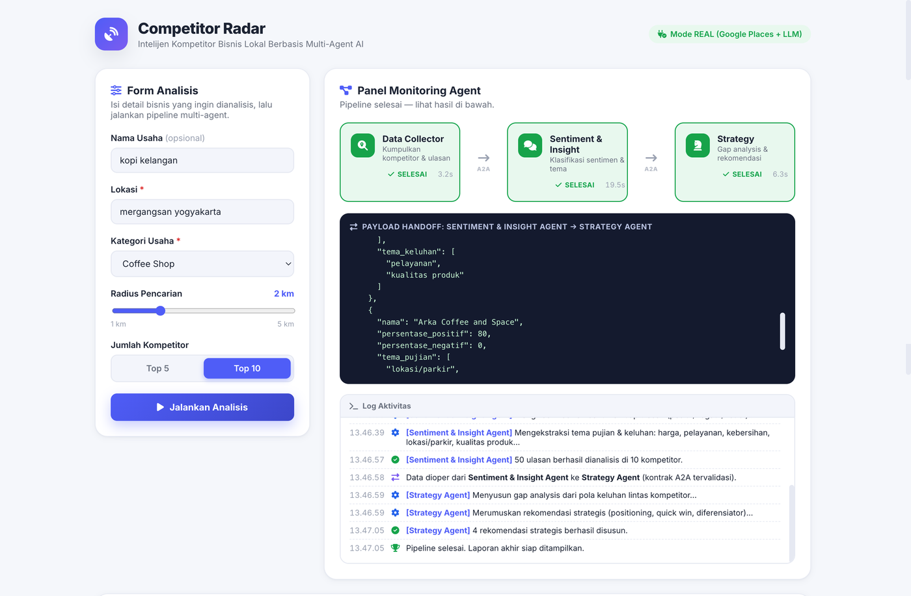
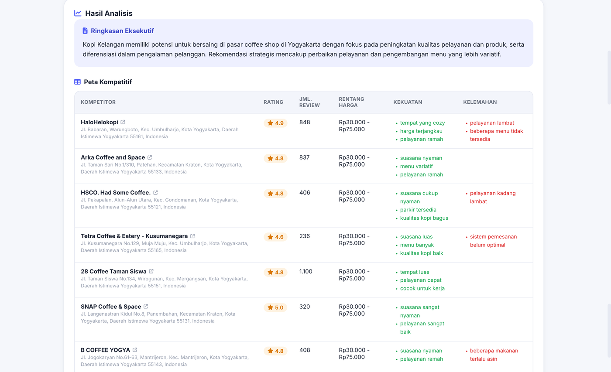
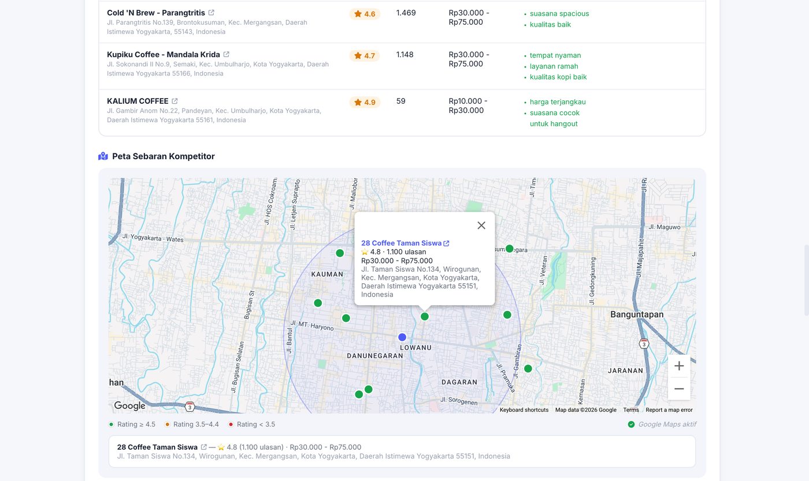
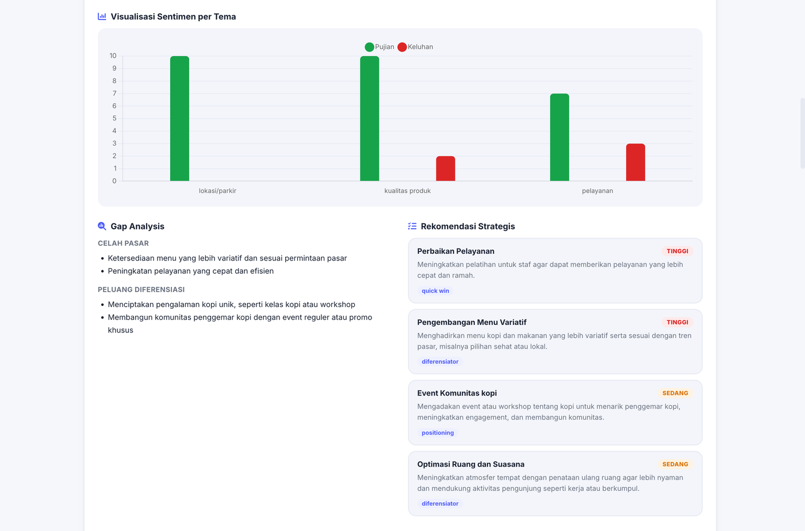
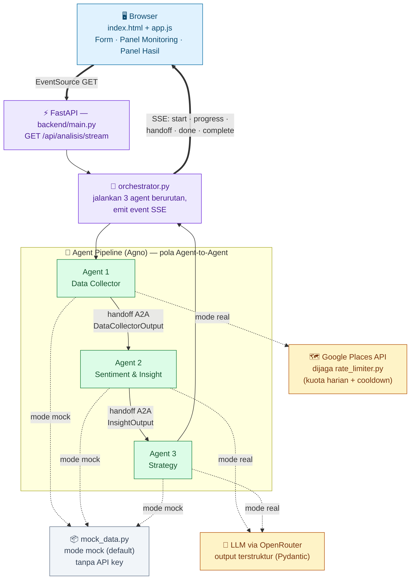

# Competitor Radar

Sistem intelijen kompetitor bisnis lokal berbasis **multi-agent AI**. Proyek demo akademik untuk UTS mata kuliah *AI Innovation & Entrepreneurship* — fokus pada kejelasan alur kerja agent (pola Agent-to-Agent) dan UI monitoring real-time, bukan skala produksi.

Pengguna memasukkan lokasi & kategori usaha → tiga agent berjalan berurutan (Data Collector → Sentiment & Insight → Strategy) → hasil berupa peta kompetitif, peta sebaran lokasi, analisis sentimen, gap analysis, dan rekomendasi strategis.

Mendukung **10 kategori usaha**: Coffee Shop, Restoran, Salon, Bengkel, Klinik, Laundry, Apotek, Minimarket, Gym/Fitness, dan Toko Fashion.

## Tampilan Aplikasi

Cuplikan layar mode **real** (Google Places API + LLM sungguhan) — studi kasus usaha "Kopi Kelangan" di Mergangsan, Yogyakarta, kategori Coffee Shop, top-10 kompetitor.

<p align="center">
  <br>
  <sub>Form Analisis &amp; Panel Monitoring Agent — durasi tiap agent dan payload handoff A2A real-time.</sub>
</p>

<p align="center">
  <br>
  <sub>Ringkasan Eksekutif &amp; Peta Kompetitif — kompetitor nyata beserta kekuatan/kelemahan.</sub>
</p>

<p align="center">
  <br>
  <sub>Peta Sebaran Kompetitor di atas Google Maps sungguhan, marker berwarna sesuai rating.</sub>
</p>

<p align="center">
  <br>
  <sub>Visualisasi Sentimen per Tema, Gap Analysis, dan Rekomendasi Strategis.</sub>
</p>

## Cara Menjalankan

Butuh Python **3.10+**. Tidak butuh API key apa pun untuk mode default (mock).

```bash
# 1) Buat virtual environment & install dependency (sekali saja)
python3 -m venv .venv
source .venv/bin/activate          # Windows: .venv\Scripts\activate
pip install -r requirements.txt

# 2) Jalankan — SATU perintah ini menjalankan backend sekaligus men-serve frontend
uvicorn backend.main:app --reload
```

Buka **http://127.0.0.1:8000** di browser. Selesai — form input, panel monitoring, dan panel hasil semua ada di satu halaman itu.

Opsional: salin `.env.example` ke `.env` untuk mengatur mode/API key (lihat bagian [Mode Real](#mode-real-opsional) di bawah).

**Ganti port** — tambahkan flag `--port`, mis. mau pakai port 8001:

```bash
uvicorn backend.main:app --reload --port 8001
```

Lalu buka `http://127.0.0.1:8001`. Dua hal yang wajib diperhatikan:
- Perintahnya **`backend.main:app`**, bukan `main:app` — modulnya ada di dalam folder `backend/` dan pakai *relative import*, jadi harus dijalankan sebagai package `backend.main`. Kalau ditulis `main:app` akan muncul error `Could not import module "main"`.
- Harus dijalankan dari folder **root proyek** ini (tempat folder `backend/` berada), bukan dari dalam `backend/`.

## Arsitektur Singkat



- **Backend**: FastAPI + [Agno](https://github.com/agno-agi/agno) (framework agent). Setiap agent = satu file di `backend/agents/`. Kontrak data antar-agent didefinisikan terpusat di `backend/schemas.py` dengan Pydantic.
- **Realtime**: Server-Sent Events (SSE) satu arah backend → frontend. Tipe event: `start`, `progress`, `handoff` (berisi preview payload JSON yang dioper antar-agent), `done` (per agent), `complete` (laporan akhir), `error`.
- **Frontend**: HTML + CSS + jQuery murni, tanpa build step. Disajikan langsung oleh FastAPI (`StaticFiles`) dari origin yang sama — tidak ada masalah CORS, meski `CORSMiddleware` tetap dipasang sebagai cadangan. Chart sentimen pakai Chart.js (CDN), ikon pakai Font Awesome (CDN).
- **Dua mode operasi** (env var `APP_MODE`, default `mock`):
  - `mock` — data kompetitor & ulasan sintetis realistis, sentimen & strategi dari heuristik rule-based. **Berjalan penuh tanpa API key.**
  - `real` — Data Collector memanggil Google Maps Places API; Sentiment & Strategy Agent memanggil LLM lewat **OpenRouter** (via Agno `Agent`, `output_schema` Pydantic untuk hasil terstruktur). Jika key tidak lengkap/gagal, otomatis fallback ke mock supaya demo tidak pernah gagal total.
- **Peta sebaran kompetitor**: setiap kompetitor (mock maupun real) punya koordinat lat/lng.
  - Jika `GOOGLE_MAPS_API_KEY` diset (independen dari `APP_MODE`) → frontend merender **Google Map sungguhan** dengan marker berwarna sesuai rating.
  - Jika tidak → frontend otomatis memakai **Leaflet.js + OpenStreetMap** (CDN) — peta geografis nyata (jalan, gedung, marker presisi), sepenuhnya gratis tanpa API key maupun billing.
  - Nama kompetitor (di tabel peta kompetitif maupun popup peta) adalah **link ke Google Maps** (pencarian tempat + ulasannya), terbuka di tab baru. Presisi ke `place_id` asli kalau mode real, atau pencarian nama+alamat kalau mode mock.

Detail lebih lengkap (konvensi kode, struktur folder) ada di `CLAUDE.md`.

### Peran Masing-Masing Agent

Ketiga agent berjalan **berurutan**, bukan paralel — output satu agent (divalidasi Pydantic) langsung jadi input agent berikutnya (`backend/orchestrator.py`), meniru pola *Agent-to-Agent* (A2A).

**1. Data Collector Agent** (`backend/agents/data_collector.py`)
- **Tugas**: mencari daftar kompetitor di sekitar lokasi yang diminta (sesuai kategori & radius), lalu mengambil sampel ulasan tiap kompetitor.
- **Mode mock**: men-generate data kompetitor & ulasan sintetis lewat `mock_data.py` (deterministik berdasarkan lokasi+kategori).
- **Mode real**: memanggil Google Maps Places API — Geocoding (lokasi → koordinat) → Nearby Search (cari kompetitor) → Place Details (rating, harga, ulasan). Dijaga `rate_limiter.py` (cooldown antar-request + kuota harian) supaya biaya tidak lepas kendali; kalau limit tercapai atau panggilan gagal, otomatis fallback ke mock.
- **Output ke Agent 2**: `DataCollectorOutput` — daftar kompetitor beserta rating, jumlah review, rentang harga, koordinat, dan ulasan mentah.

**2. Sentiment & Insight Agent** (`backend/agents/sentiment_insight.py`)
- **Tugas**: menerima output Agent 1, mengklasifikasikan sentimen tiap ulasan (positif/negatif/netral), mengekstraksi tema (harga, pelayanan, kebersihan, lokasi/parkir, kualitas produk), lalu merangkum kekuatan & kelemahan tiap kompetitor.
- **Mode mock**: heuristik murni — sentimen dari rating ulasan (≥4 positif, =3 netral, ≤2 negatif), tema dari keyword matching Bahasa Indonesia. Tanpa LLM sama sekali.
- **Mode real**: didelegasikan ke LLM lewat OpenRouter (via Agno `Agent` dengan `output_schema` Pydantic) supaya hasil klasifikasi & ekstraksi tema lebih natural, bukan sekadar keyword matching.
- **Output ke Agent 3**: `InsightOutput` — insight per kompetitor (persentase sentimen, tema pujian/keluhan, kekuatan/kelemahan) plus ringkasan tema pasar lintas kompetitor.

**3. Strategy Agent** (`backend/agents/strategy.py`)
- **Tugas**: menerima output Agent 2, menyusun **gap analysis** (celah pasar yang belum dilayani baik kompetitor) dan **rekomendasi strategis** yang actionable (positioning, quick win, diferensiator) untuk usaha pengguna.
- **Mode mock**: heuristik berbasis agregasi tema pujian/keluhan lintas kompetitor — tema paling sering dikeluhkan jadi celah pasar & quick win, tema yang jarang dipuji jadi peluang diferensiasi.
- **Mode real**: didelegasikan ke LLM lewat OpenRouter untuk merumuskan gap analysis & rekomendasi yang lebih kontekstual dibanding heuristik rule-based.
- **Output**: `StrategyOutput` (executive summary, gap analysis, daftar rekomendasi berprioritas, disclaimer) — bagian akhir laporan yang dikirim ke frontend lewat event SSE `complete`.

Ketiganya punya pola yang sama: **selalu jalan** (mock atau real tidak pernah gagal total berkat fallback otomatis), dan kontrak inputnya divalidasi lewat model Pydantic di `backend/schemas.py` sebelum diteruskan ke agent berikutnya.

## Mode Real (opsional)

Isi `.env` (lihat `.env.example`):

```
APP_MODE=real
GOOGLE_MAPS_API_KEY=isi_key_anda
OPENROUTER_API_KEY=isi_key_anda
OPENROUTER_MODEL=openai/gpt-4o-mini
```

- `GOOGLE_MAPS_API_KEY` dari [Google Cloud Console](https://console.cloud.google.com) — aktifkan **Places API**, **Geocoding API**, dan **Maps JavaScript API**. Butuh billing account aktif, tapi kuota gratis bulanan biasanya cukup untuk demo. Kalau tidak diisi, Data Collector tetap pakai data mock dan peta pakai Leaflet/OpenStreetMap gratis — keduanya independen dari `APP_MODE`.
- `OPENROUTER_API_KEY` dari [openrouter.ai/keys](https://openrouter.ai/keys). Satu key OpenRouter bisa dipakai ganti-ganti model/provider (OpenAI, Anthropic, Google, bahkan model gratis) cukup dengan mengubah `OPENROUTER_MODEL` — format `"<provider>/<model>"`, mis. `openai/gpt-4o-mini`, `anthropic/claude-3.5-haiku`, atau `meta-llama/llama-3.1-8b-instruct:free`.

Tidak ada key yang di-hardcode di kode — semua dibaca dari environment variable. Setelah mengubah `.env`, restart server (perubahan `.env` tidak otomatis ter-reload oleh `--reload`, yang hanya memantau file `.py`).

## Batasi Biaya Google API

Google mensyaratkan billing account (kartu kredit) untuk `GOOGLE_MAPS_API_KEY`, meski ada kuota gratis bulanan. Supaya tagihan tidak membengkak tanpa disadari (bug, klik berulang, atau demo yang lupa dimatikan), ada dua lapis pengaman:

**1. Level aplikasi (sudah aktif otomatis, bisa diatur di `.env`)**

```
GOOGLE_API_DAILY_LIMIT=80              # maks. panggilan Google API (geocode+nearby+place details) per hari
GOOGLE_API_MIN_INTERVAL_SECONDS=3      # jeda minimum antar-request real-mode
```

Kalau limit harian tercapai, request terlalu cepat menyusul request sebelumnya, **atau panggilan ke Google API gagal karena sebab apa pun** (key salah, API belum di-*enable*, billing belum aktif, kuota Google sendiri habis, dll), backend **otomatis fallback ke data mock** untuk request itu — tidak pernah gagal total, dan alasannya kelihatan langsung di panel log, bukan ditelan diam-diam. Contoh pesan yang muncul di `sumber_data`/log:

- `mock (kuota Google API harian tercapai: 80/80)`
- `mock (cooldown 3s belum lewat sejak request Google API terakhir)`
- `mock (Google API gagal: ValueError: Geocoding API: REQUEST_DENIED — This API is not activated on your API project...)` — pesan asli dari Google, biasanya langsung menunjukkan API mana yang perlu di-*enable* di Cloud Console.

Cek sisa kuota kapan saja lewat `GET /api/health` (field `google_api_kuota`). Batas ini in-memory (reset kalau server di-restart) — cukup untuk mencegah lonjakan tak sengaja saat demo, bukan pengganti kontrol resmi Google.

**2. Level Google Cloud Console (pengaman utama — pasang ini juga)**

- **Quotas**: APIs & Services → pilih API (Places/Geocoding/Maps JavaScript) → tab *Quotas* → set batas "Requests per day" sesuai kebutuhan. Ini hard-limit dari Google sendiri, berlaku walau ada bug di aplikasi atau seseorang memakai key-nya langsung di luar app ini.
- **Budget Alerts**: Billing → Budgets & alerts → buat budget kecil (mis. Rp50.000) dengan alert email di 50%/90%/100% — supaya langsung tahu kalau ada pemakaian tidak wajar.
- **API key restriction** (sudah disinggung di atas): batasi ke HTTP referrer origin aplikasi ini + hanya 3 API yang dipakai, supaya key tidak bisa disalahgunakan dari luar kalau bocor.

Untuk demo UTS dengan beberapa kali run manual, ketiga lapis ini (app-level limiter + quota + budget alert) membuat risiko tagihan tak terduga sangat kecil.

## Struktur Folder

```
backend/
  main.py                     # FastAPI app, mount StaticFiles, endpoint SSE, /api/health, /api/maps-key
  config.py                   # baca environment variable
  schemas.py                  # semua model Pydantic (request + kontrak antar-agent)
  orchestrator.py             # jalankan 3 agent berurutan, emit event SSE
  mock_data.py                # generator data mock realistis (kompetitor, ulasan, koordinat)
  rate_limiter.py             # pengaman kuota/cooldown Google API
  agents/
    data_collector.py         # Agent 1
    sentiment_insight.py      # Agent 2
    strategy.py               # Agent 3
frontend/
  index.html                  # struktur UI
  style.css                   # styling flat design
  app.js                      # jQuery + EventSource SSE + Chart.js + Leaflet/Google Maps
CLAUDE.md
README.md
requirements.txt
.env.example
```

## Asumsi & Keputusan Teknis


1. **Python 3.10** dipakai (bukan 3.9 bawaan sistem) karena kompatibilitas dengan library `agno` versi terbaru. Dipin lewat `.python-version` (pyenv).
2. **Klasifikasi sentimen mode mock** memakai heuristik rating per-ulasan (rating ≥4 → positif, =3 → netral, ≤2 → negatif) dikombinasikan dengan keyword matching Bahasa Indonesia untuk ekstraksi tema — bukan NLP/LLM sungguhan, karena mode mock harus jalan tanpa API key sama sekali.
3. **Data mock deterministik**: nama kompetitor, rating, ulasan, dan koordinat peta digenerate dengan seed dari kombinasi lokasi+kategori, supaya input yang sama menghasilkan tampilan yang konsisten saat demo berulang, tapi tetap bervariasi antar lokasi/kategori berbeda.
4. **Jumlah kompetitor** dibatasi ke pilihan **5 atau 10** sesuai spesifikasi UI (segmented control); nilai lain yang dikirim langsung ke API akan dibulatkan ke opsi terdekat.
5. **Radius pencarian** dibatasi 1–5 km sesuai spesifikasi slider.
6. **Mode real** menggunakan Google Places **Nearby Search + Place Details** (butuh Geocoding untuk mengubah nama lokasi jadi koordinat) dan **OpenRouter** sebagai provider LLM via Agno `OpenRouter` model — dipilih karena satu API key bisa mengakses banyak model/provider berbeda (termasuk model gratis), praktis untuk demo. Provider lain bisa ditambahkan dengan mengganti `agno.models.openrouter.OpenRouter` di `sentiment_insight.py`/`strategy.py`.
7. **Fallback otomatis ke mock** diterapkan di setiap agent bila mode `real` diminta tapi API key kosong/tidak valid/panggilan gagal — supaya sesi demo langsung di depan kelas tidak pernah gagal total karena masalah jaringan/quota.
8. **Skema LLM dipisah dari skema penuh** (`InsightOutputLLM`/`InsightKompetitorLLM` vs `InsightOutput`/`InsightKompetitor` di `schemas.py`). Alasan: (a) *structured output* ketat OpenAI/OpenRouter tidak mendukung field `dict` generik tanpa properti tetap, jadi field agregat (`ringkasan_tema_pasar`, `total_ulasan_dianalisis`) dihitung ulang di backend, bukan diminta ke LLM; (b) field `ulasan_terklasifikasi` (echo tiap ulasan individual) sengaja tidak diminta ke LLM karena boros token dan berisiko membuat respons JSON terpotong — field ini tidak dipakai di frontend juga. `tema_pujian`/`tema_keluhan` memakai enum `TemaUlasan` baku (bukan string bebas) berisi **5 tema sentimen standar** (harga, pelayanan, kebersihan, lokasi/parkir, kualitas produk) — berlaku untuk semua kategori usaha, supaya LLM konsisten dan cocok dengan yang dipakai chart. (Jangan tertukar dengan **10 kategori usaha** yang berbeda konsep — lihat poin 16.)
9. **Tanpa database/persistensi** — setiap analisis bersifat stateless, hasil hanya ada di memori selama request SSE berlangsung. Sesuai kebutuhan demo, bukan aplikasi produksi.
10. **Tanpa autentikasi** — aplikasi diasumsikan dijalankan lokal untuk keperluan presentasi/demo, bukan diekspos ke publik.
11. Delay kecil (~0.5 detik) disisipkan antar-event SSE di `orchestrator.py` supaya panel monitoring terasa "hidup" saat presentasi, mengingat proses mock sebenarnya berjalan hampir instan.
12. **Koordinat kompetitor pada mode mock bersifat sintetis** — dihasilkan di sekitar titik pusat kota (dicocokkan dari nama lokasi ke daftar kota besar Indonesia, atau titik acak deterministik di Pulau Jawa jika tidak dikenali), bukan hasil geocoding sungguhan. Cukup realistis untuk keperluan visualisasi demo.
13. **Google Maps JavaScript API key di-reuse dari `GOOGLE_MAPS_API_KEY`** yang sama dipakai untuk Places API, dan diekspos ke frontend lewat endpoint `/api/maps-key`. Ini sesuai praktik umum Google — Maps JS key memang didesain dipakai di sisi client (dibatasi lewat HTTP referrer restriction di Google Cloud Console), berbeda dari key REST/server yang harus dirahasiakan. Fitur peta ini aktif independen dari `APP_MODE`: kalau key tersedia, kompetitor mock pun akan tampil di atas Google Map sungguhan.
14. **Link nama kompetitor ke Google Maps** dibangun dari `place_id` (mode real, presisi) atau dari pencarian teks nama+alamat (mode mock, karena kompetitor mock tidak punya `place_id` sungguhan) — keduanya lewat `https://www.google.com/maps/...`, tidak butuh API key untuk sekadar membuka link ini di tab baru.
15. **Pengaman biaya Google API** (`backend/rate_limiter.py`) sengaja in-memory per proses (bukan disimpan ke database/file) — cukup untuk mencegah lonjakan tak sengaja dalam satu sesi demo, tapi reset kalau server di-restart. Untuk perlindungan yang benar-benar tidak bisa ditembus, pengaturan **Quota** & **Budget Alert** di Google Cloud Console tetap wajib (lihat bagian "Batasi Biaya Google API").
16. **10 kategori usaha** didukung (`KategoriUsaha` di `schemas.py`): Coffee Shop, Restoran, Salon, Bengkel, Klinik, Laundry, Apotek, Minimarket, Gym, Toko Fashion. Menambah kategori baru butuh dua tempat: (a) `backend/mock_data.py` — entri `NAMA_POOL`/`ULASAN_TEMPLATE`/`HARGA_RANGE` untuk kategori itu (dipakai mode mock); (b) `frontend/index.html` — opsi baru di dropdown. Mode real tidak butuh perubahan tambahan karena `kategori.value` langsung dipakai sebagai keyword pencarian ke Google Places API. Kelima tema sentimen (lihat poin 8) sengaja dibuat generik supaya otomatis relevan untuk kategori usaha apa pun tanpa perlu disesuaikan lagi.

## Menguji Cepat via curl

```bash
curl -s http://127.0.0.1:8000/api/health

curl -N "http://127.0.0.1:8000/api/analisis/stream?lokasi=Dago,%20Bandung&kategori=coffee%20shop&radius_km=2&top_n=5"
```
